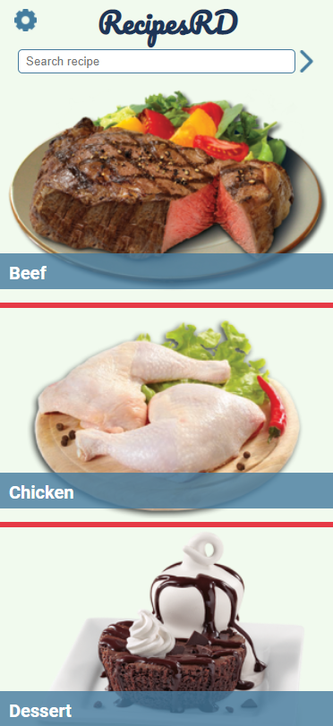

  

  
<h1 align="center">
  RecipesRD
</h1>

<h4 align="center">
  RecipesRD is here for you, filtering every recipe based on what you have in your kitchen. 
</h4>

  

  
Additional description about the project and its features.

## Built With

- React
- Redux

## Live Demo

[Live Demo Link](https://livedemo.com)

## Getting Started

To get a local copy up and running follow these simple example steps.

### Prerequisites

- Code Editor.
- Browser
- Node.js installed.
- React knowledge.

### Setup

- First things is to download the repository files or to clone it.

### Install

- Install all the dependencies running `npm install` on your terminal.

### Usage

- Run `npm start` and open `http://localhost:3000` on the browser.

### Run tests

- Run `npm run test`

### Deployment

- Deployed on [Netfily](https://www.netlify.com)

## 🤝 Contributing

Contributions, issues, and feature requests are welcome!

Feel free to check the [issues page](https://github.com/luisvinicius09/recipesRD/issues).

## Show your support

Give a ⭐️ if you like this project!

## Acknowledgments

- Hat tip to anyone whose code was used
- Inspiration
- etc

## 📝 License

This project is [MIT](lic.url) licensed.

<h2 align="center">
  Author(s)  
</h2>

  <strong>Luis Vinicius M. Santos 👤</strong>  

  GitHub: <a href="https://github.com/luisvinicius09">@githubhandle</a>

  LinkedIn: <a href="https://www.linkedin.com/in/luis-vinicius/">LinkedIn</a>

